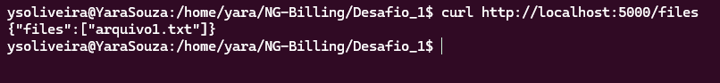
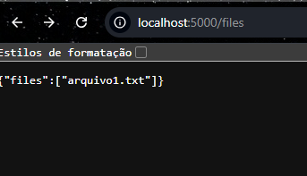

# Documento explicando o Desafio 1

### Arquivo app.py

- Arquivo Python responsável por expor via HTTP a lista de arquivos que estão dentro do diretório /data.

- A aplicação roda no localhost na porta 5000 e disponibiliza a rota /files, que retorna um JSON contendo todos os arquivos encontrados.

### Arquivo requirements.txt

- Lista as dependências necessárias para executar o app.py.

- Quando o container for criado, o Docker instala tudo com base nesse arquivo.

### Arquivo .dockerignore

- Serve para ignorar arquivos desnecessários durante o build da imagem, deixando o processo mais leve e rápido.

### Arquivo Dockerfile

- Utiliza a imagem oficial do Python como base.
- Cria um usuário e define o diretório onde a aplicação vai rodar.
- Instala as dependências.
- Copia os arquivos da aplicação para dentro da imagem.
- Expõe a porta 5000 e executa a API.

# Construindo a imagem: 

- Fiz login no Docker Hub e criei o repositório público: https://hub.docker.com/repository/docker/ysoliveira/file-reader/general

*Comandos Docker usados*

```
docker build -t ysoliveira/file-reader:0.1 .

docker tag d2e498a8ccb1 ysoliveira/file-reader:0.1

docker push ysoliveira/file-reader:0.1

docker run -d \
  -p 5000:5000 \
  -v /home/yara/NG-Billing/Desafio_1/data:/data \
  --name file-reader \
  ysoliveira/file-reader:0.1
```

# Testando localmente:

*Via curl: http://localhost:5000/files*



*Via navegador: http://localhost:5000/files*



# Referências

- Docker <br>
https://docs.docker.com/reference/dockerfile <br>
https://docs.docker.com/reference/cli/docker/buildx/build <br>
https://docs.docker.com/engine/storage/volumes <br>

- Python <br>
https://pip.pypa.io/en/stable/user_guide

- Flash <br>
https://flask.palletsprojects.com/en/stable <br>
https://flask.palletsprojects.com/en/latest/quickstart