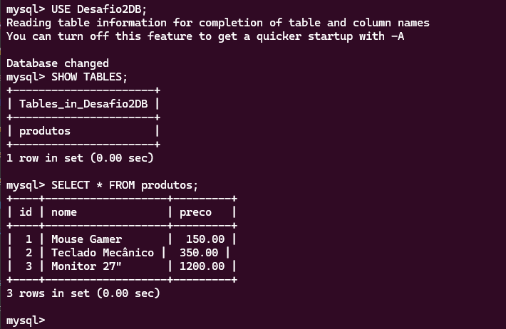
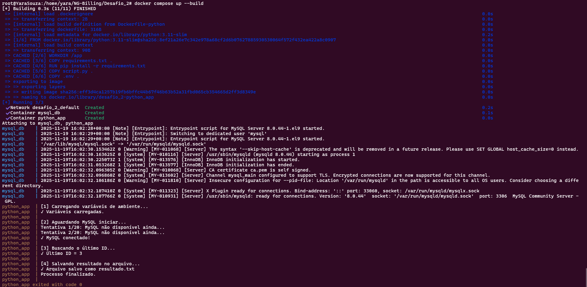

# Execução de Script Python com Banco MySQL em Docker

Este desafio foi adaptado a partir de uma necessidade inicial de conexão com um banco Oracle e envio de resultados por e-mail.
Como não havia uma conta Oracle disponível para testes, foi criada uma solução alternativa utilizando:

- MySQL executando em container Docker
- Aplicação Python também em container
- Conexão entre os dois serviços via Docker Compose
- Registro do resultado da consulta em um arquivo local, em vez de envio por e-mail

Mantendo também a segurança nas credenciais por meio da criação de um arquivo .env.

### Serviço MySQL

- Criei um container baseado no MySQL 8, definindo no Dockerfile a imagem utilizada, as variáveis de conexão do banco e o script de inicialização.
- Também criei um arquivo init.sql contendo as tabelas necessárias para fins de teste.

*Obs: a imagem MySQL foi buildada e publicada no repositório do Docker Hub: https://hub.docker.com/repository/docker/ysoliveira/mysql/tags*

### Python

- No Python, criei um script que possui quatro etapas: aguardar o MySQL iniciar, conectar ao banco, executar o SELECT, salvar o conteúdo no arquivo resultado.txt e finalizar o script.

### Docker Compose

- O Docker Compose foi necessário, pois o banco MySQL está em um container, e ao executar o script Python localmente ocorria erro de conexão.
Por isso optei por utilizar o Python também em container.
- O Compose cria a rede interna para que o Python consiga acessar o banco pelo hostname do serviço.

# Teste 

Subir os containers

```
docker compose up --build
```

*Banco de dados e tabelas:*


*Execução do composer:*


# Referência

- Docker <br>
https://docs.docker.com/reference/dockerfile <br>
https://docs.docker.com/compose/bridge/use-model-runner

- Mysql <br>
https://hub.docker.com/_/mysql <br>
https://dev.mysql.com/doc/refman/8.0/en

- Python <br>
https://dev.mysql.com/doc/connector-python/en

- Env <br>
https://pypi.org/project/python-dotenv
https://docs.docker.com/compose/how-tos/environment-variables