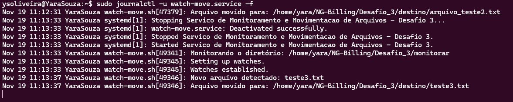

# Monitoramento e Movimentação de Arquivos com Systemd

O script sera executado como um serviço gerenciado pelo systemd, garantindo que seja iniciado com o sistema e rode em background.

### Estrutura utilizada

monitorar/ → onde novos arquivos serão criados <br>
destino/ → para onde os arquivos serão movidos <br>
watch-move.sh → script que faz o monitoramento <br>
watch-move.service → serviço systemd <br>

### Script de monitoramento (watch-move.sh)

- Foram definidos os diretórios em variáveis (WATCH_DIR e DEST_DIR).
- O script também cria os diretórios caso eles não existam.
- Utiliza inotifywait para monitorar eventos de criação (-e create).
- Ao detectar um arquivo novo, ele é movido automaticamente para o diretório de destino.

### Configuração do serviço systemd

Ativação do serviço:

```
sudo systemctl daemon-reload
sudo systemctl start watch-move.service
sudo systemctl enable watch-move.service
```

Comandos úteis:
```
sudo systemctl status watch-move.service
sudo journalctl -u watch-move.service -f
```

# Teste

*criei um arquivo usando o comando:*
```
echo "novo teste" > /home/yara/NG-Billing/Desafio_3/monitorar/teste3.txt
```

*Acompanhamento via logs:*



# Referências

- Inotifywait <br>
https://manpages.ubuntu.com/manpages/jammy/en/man1/inotifywait.1.html

- Systemd <br>
https://www.freedesktop.org/software/systemd/man/latest/systemd.service.html

- Bash <br>
https://www.gnu.org/software/bash/manual/bash.html